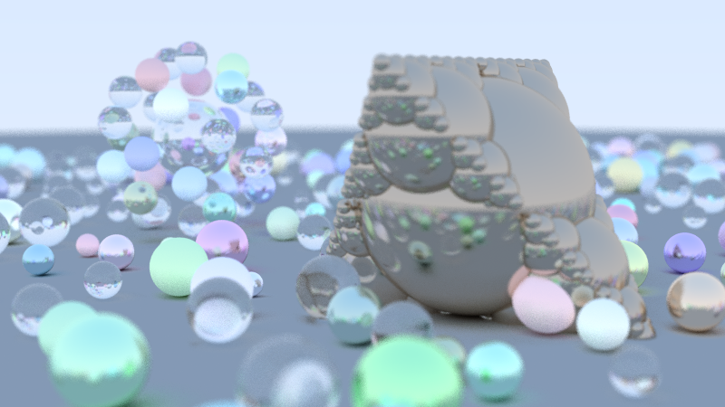
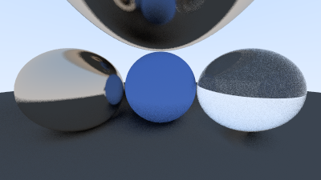

# Raytracing in a weekend (en Python) 
Para correr el TP: `python main.py --scene ESCENA` con `ESCENA`: 
- `escena_caratula` para renderizar la escena que aparece en la carátula del informe (tarda muchísimo tiempo).
-  `escena_simple` para renderizar una escena simple que tarda al rededor de 3 minutos en una CPU de 6 cores.

Opcionalmente se puede usar el argumento `--max-cpus N_PROC` para seleccionar la cantidad máxima de filas que se procesan en simultáneo. Si no se específica procesa tantas filas como tenga threads lógicos disponibles el procesador.
  
# Requisitos (Python):  
- OpenCV  
- Numpy
- Testeado en Python 3.13

# Escena de la caratula

# Escena simple

